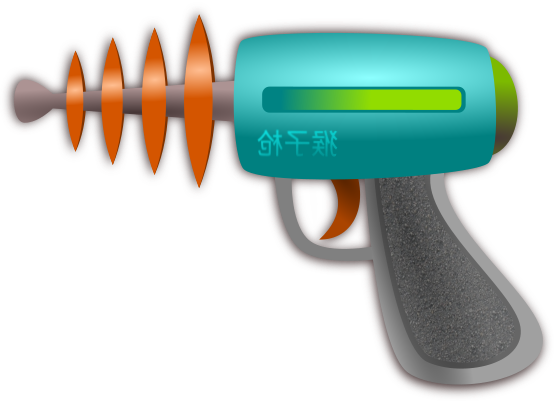

# TaskBlaster

<p align="center">
  
</p>

**TaskBlaster** is a cross-platform desktop app for writing, organizing, and running C# maintenance scripts (`.csx`) with real user interfaces — not command-line prompts.

It exists to solve a recurring, awkward problem: you need a one-off (or rarely-run) maintenance task — rotate a Key Vault secret, re-queue dead-lettered Service Bus messages, patch a few rows in a database, generate a report — and the options are all bad:

* A **console app** means parsing args, hand-rolling prompts, and re-compiling every time a parameter changes.
* A **full GUI app** is overkill for a 40-line chore.
* A **shared script dumping ground** has no input validation, no UI, and no safety net.

TaskBlaster takes a middle path: you write a plain `.csx` file, optionally pair it with a JSON form describing its inputs, and TaskBlaster handles the rest — rendering the form, validating input, running the script under Roslyn, streaming output into the built-in terminal, and resolving any secrets the script asks for out of an encrypted local vault.

---

## How it works

1. **Write a script.** Drop a `.csx` file into your scripts folder. It can `#r` NuGets and `using` any namespace, just like `dotnet-script`.
2. **Describe its inputs (optional).** Pair the script with a GuiBlast JSON form — text fields, dropdowns, checkboxes, conditional visibility, button actions. Build it by hand or use the built-in **visual form designer**.
3. **Store credentials in the local vault.** Add API tokens, connection strings, or anything else into the **Secrets** tab. Everything is encrypted at rest with Argon2id + AES-GCM via [SecretBlast](https://www.nuget.org/packages/SecretBlast).
4. **Run it.** TaskBlaster prompts the user with the form, injects the answers, executes the script via Roslyn, and streams stdout/stderr live to the terminal panel. Scripts pull secrets from the vault on demand via the `Secrets` global; the user is prompted to unlock if the vault is locked.
5. **Connect to Azure without secrets in code.** Scripts can call into [AzureBlast](https://www.nuget.org/packages/AzureBlast) to talk to Azure SQL, Service Bus, and Key Vault, handing it the vault resolver instead of a hard-coded connection string.

This is the successor to the legacy `ScriptRunner.Plugins` package, rebuilt on .NET 10 + Avalonia 12 and the **Blast** library family.

## Who it's for

* **DBAs / data engineers** running ad-hoc SQL maintenance, bulk updates, or data fixes
* **Platform / DevOps engineers** managing Azure resources, rotating secrets, draining queues
* **Support engineers** running well-defined recovery scripts safely, with typed inputs
* **Anyone** who keeps a folder full of "scratch" C# scripts and wants them to feel like real tools

## Features

* Integrated `.csx` editor with syntax highlighting (AvaloniaEdit + TextMate grammars)
* Roslyn-based script host with live stdout/stderr streaming into a terminal panel
* **Visual form designer** for GuiBlast JSON forms — field list, per-type property editor, visibility rules, action buttons, live preview
* **Encrypted secrets vault** (Argon2id + AES-GCM), surfaced as a `Secrets` global inside scripts
* **Named connections** — a `connections.json` file maps a friendly name to a bag of fields where each field is either a plaintext literal (URL, server, account name) or a pointer into the vault (token, password). Scripts grab the whole bag with `Secrets.GetConnection("name")` (dynamic) or `Secrets.GetConnection<T>("name")` (typed); Blast libraries that take a resolver delegate (NetworkBlast, AzureBlast) receive the wrapped resolver via `Secrets.Resolver`.
* **Vault-backed select fields** in forms — declare a select's options as "vault keys in category X" and TaskBlaster materialises them at form-load time
* Graceful abort when the user cancels a vault-unlock prompt mid-script (no stack dump; the run ends as `Cancelled`)
* Configurable scripts folder, forms folder, vault folder, editor font size, and theme
* Demo scripts and forms shipped out of the box, plus a dev-only `--seed-demos` flag to refresh them in place

## Stack

* .NET 10
* Avalonia 12, Avalonia.Controls.DataGrid, AvaloniaEdit + TextMateSharp.Grammars
* Microsoft.Extensions.DependencyInjection (singletons + transients wired in `Program.cs`)
* Microsoft.CodeAnalysis.CSharp.Scripting (Roslyn) for `.csx` execution
* [UtilBlast](https://www.nuget.org/packages/UtilBlast) 1.2.0 — common utilities, JSON ⇆ CSV, JObject flatten / GetByPath, plus the `Blast` display DSL (heading / status / table / kv) for structured script output
* [AzureBlast](https://www.nuget.org/packages/AzureBlast) 2.1.0 — SQL / Service Bus / Key Vault, with vault-aware resolver overloads
* [GuiBlast](https://www.nuget.org/packages/GuiBlast) 2.1.0 — form specs and modal prompts
* [NetworkBlast](https://www.nuget.org/packages/NetworkBlast) 1.0.0 — REST / OData / SOAP, vault-aware via the same resolver shape
* [SqliteBlast](https://www.nuget.org/packages/SqliteBlast) 1.0.0 — local SQLite for staging/caching/migrations, vault-aware path
* [SecretBlast](https://www.nuget.org/packages/SecretBlast) 1.0.2 — encrypted local vault

## Quick start

```bash
git clone https://github.com/petervdpas/TaskBlaster.git
cd TaskBlaster
dotnet run --project TaskBlaster
```

On first launch TaskBlaster creates `~/.taskblaster/` and seeds it with the bundled demo scripts and forms.

## Writing scripts

Scripts are plain `.csx` files. TaskBlaster preimports the usual BCL namespaces (`System`, `System.IO`, `System.Linq`, `System.Text`, `System.Collections.Generic`, `System.Threading`, `System.Threading.Tasks`) and force-loads the Blast assemblies so you can `using GuiBlast;` / `using AzureBlast;` / `using NetworkBlast;` / `using SqliteBlast;` / `using UtilBlast.Extensions;` without a `#r`.

### Top-level identifiers

A `ScriptGlobals` object is handed to Roslyn on every run, surfacing one top-level identifier today:

| Identifier | Type            | Purpose                                 |
| ---------- | --------------- | --------------------------------------- |
| `Secrets`  | `ScriptSecrets` | Vault accessor (categories, keys, resolve) |

```csharp
// Sync — fine, scripts run off the UI thread.
var token = Secrets.Resolve("api", "github-token");

// Async form, with cancellation.
var conn  = await Secrets.ResolveAsync("azure", "prod-sql");

// Inventory (values are never returned by these).
var cats = Secrets.Categories();
var keys = Secrets.Keys("Azure");

// Delegate shape for libraries that take a named-connection resolver:
//   var db = new SomeClient(Secrets.Resolver, "prod-sql");
Func<string, string, CancellationToken, Task<string>> r = Secrets.Resolver;
```

If the vault is locked the first vault call pops the unlock dialog. Cancelling that prompt aborts the script as `Cancelled` rather than throwing a stack trace into the terminal.

### Prompts

`GuiBlast.Prompts` provides quick modal prompts when you don't want a full form file:

```csharp
using GuiBlast;

var name = Prompts.Input("Hello", "Your name?");
if (Prompts.Confirm("Proceed?", "Continue?")) {
    Console.WriteLine($"Hi {name}");
}
```

For richer inputs build a JSON form in code with `DynamicForm.ShowJsonAsync` (see `DemoScripts/inline-form.csx`).

## Forms

A form is a JSON document describing fields, layout, visibility, and action buttons. Forms live in their own folder (default `~/.taskblaster/forms/`) and are previewed standalone from the **Forms** tab; the visual designer round-trips the same JSON.

To use a form *from* a script, either build the JSON inline (see `inline-form.csx`) or load a form file from disk (see `quick-task-demo.csx`) and pass it to `DynamicForm.ShowJsonAsync`. TaskBlaster does not auto-pair scripts and forms by filename.

### Vault-backed select options

Any `select` field can declare its options as vault keys in a category. The expander materialises them at form-load time; GuiBlast itself never sees the vault.

```jsonc
{
  "key": "secret",
  "type": "select",
  "label": "Connection secret",
  "optionsFrom": { "source": "vault", "category": "Azure" }
}
```

If `options[]` is empty the expander populates it from the vault. If you've already picked a subset in the designer those are kept verbatim and the `optionsFrom` hint is stripped on its way to GuiBlast. Forms with no hints round-trip through the expander unchanged.

See `DemoForms/deploy.json` for a worked example with a vault-backed select and conditional visibility.

## Vault

The **Secrets** tab manages an encrypted local vault. Each entry has a `category`, `key`, `value`, and optional description; on disk, every secret is stored under an opaque GUID with the (category, key, value, description, timestamps) packed into a JSON envelope that's encrypted as a single SecretBlast value. Filenames leak nothing about the structure.

* **KDF:** Argon2id, 256 MiB / 3 iterations / 4 lanes for production; tests override to a fast profile.
* **Cipher:** AES-GCM (12-byte nonces, 16-byte tags), with a per-secret AAD bound to the vault id and entry name so swapping `*.secret` files in from another vault fails authentication loudly.
* **Auto-lock:** 15 min idle by default.
* **Password change:** rewrites the whole vault under the new key with an atomic-rename rollback path.

Scripts read from the vault via the `Secrets` global; values never leave SecretBlast except as a returned string in the script's own memory.

## Connections

The **🔗 Connections** tab manages a `connections.json` file that maps a connection name to a bag of fields. Each field is either a plaintext literal or a pointer into the vault, so non-secret config (URLs, server names, timeouts) doesn't have to live behind the unlock prompt while real secrets stay encrypted.

```jsonc
// ~/.taskblaster/connections.json
{
  "github": {
    "baseUrl": { "value":    "https://api.github.com" },
    "token":   { "fromVault": { "category": "github-secrets", "key": "pat" } }
  },
  "prod-sql": {
    "server":   { "value":    "tcp:my-server.database.windows.net,1433" },
    "database": { "value":    "main" },
    "user":     { "value":    "tb-runtime" },
    "password": { "fromVault": { "category": "azure-sql", "key": "prod-pw" } }
  }
}
```

The library convention (per `NetworkBlast` and `AzureBlast 2.1+`): the connection name is the resolver "category", and field keys are the well-known names the library asks for. NetworkBlast wants `baseUrl` + `token`; AzureBlast SQL wants `server` / `database` / `user` / `password`. Resolver semantics:

* A declared connection is **authoritative for its name** — only fields it declares are honored; asking for an undeclared key returns an empty string without ever calling the vault.
* If the connection contains **any** `fromVault` field, the resolver primes the vault as soon as the connection is consulted, so the unlock prompt fires up-front rather than deferred until a specific vault-backed field happens to be read. A pure-plaintext connection (every field a `value`) never touches the vault.
* If a name has no entry in `connections.json` at all, lookups fall through to the raw vault resolver — all-vault scripts that predate the connections layer keep working unchanged.

Three ways scripts use a connection:

```csharp
// 1) Direct field lookup, sync.
var url = Secrets.Resolve("github", "baseUrl");

// 2) Whole-bag dynamic — `var conn` infers `dynamic`.
var conn = Secrets.GetConnection("github");
var url2  = conn.baseUrl;     // DynamicObject member access
var token = conn.token;       // case-insensitive fallback also matches "Token"

// 3) Whole-bag typed — bind to a record / class.
record GithubConn(string BaseUrl, string Token);
var c = Secrets.GetConnection<GithubConn>("github");

// 4) Hand the resolver to a Blast library — name = category, library asks for its field keys.
using NetworkBlast;
var api = new NetClient(Secrets.Resolver, "github");
```

If a connection isn't in the file, the resolver falls through to the vault directly so all-vault setups keep working unchanged. `Secrets.Connections()` returns the registered names so a script can build a quick picker.

## Data layout

```
~/.taskblaster/
├── config.json        # scripts/forms/vault folder paths, editor prefs, theme
├── connections.json   # named connections (plaintext + fromVault pointers)
├── scripts/           # your .csx scripts
├── forms/             # your .json form specs
└── vault/
    ├── vault.json     # SecretBlast header (KDF params, canary, vault id)
    └── secrets/       # *.secret files, opaque GUID-named
```

All three folders are configurable from the **Settings** dialog.

## Refreshing the bundled demos (developer)

The first-run seeder only copies *missing* files into your scripts and forms folders, so updates to the shipped demos in the repo don't reach an existing install. While iterating on the demos you can force-overwrite with:

```bash
dotnet run --project TaskBlaster -- --seed-demos
```

This copies every `DemoScripts/*.csx` and `DemoForms/*.json` from the build output into the configured target folders, overwriting existing files. It's a developer convenience, not a user feature.

### Bundled demos

| File                                | What it shows                                        |
| ----------------------------------- | ---------------------------------------------------- |
| `DemoScripts/hello.csx`             | Smallest possible script.                            |
| `DemoScripts/sum-numbers.csx`       | Arithmetic / output streaming.                       |
| `DemoScripts/input-demo.csx`        | `Prompts.Input` modal.                               |
| `DemoScripts/confirm-demo.csx`      | `Prompts.Confirm` modal.                             |
| `DemoScripts/env-report.csx`        | Runtime / loaded-Blast-assemblies report.            |
| `DemoScripts/inline-form.csx`       | A full GuiBlast form built and shown from code.      |
| `DemoScripts/quick-task-demo.csx`   | Load `DemoForms/quick-task.json` from disk and show it. |
| `DemoScripts/secret-resolve.csx`    | Pick a key from a vault category, print its value.   |
| `DemoScripts/vault-report.csx`      | Inventory of vault categories and key counts.        |
| `DemoScripts/azure-sql-template.csx`| Template for an AzureBlast SQL query (inline + vault-backed). |
| `DemoScripts/network-demo.csx`      | Anonymous httpbin GET via NetworkBlast.            |
| `DemoScripts/network-odata-demo.csx`| Typed LINQ-flavored OData against the public Northwind service. |
| `DemoScripts/sqlite-demo.csx`       | Local SQLite store via SqliteBlast — insert / query / transaction. |
| `DemoScripts/json-csv-demo.csx`     | UtilBlast 1.1 JSON ⇆ CSV bridge + JObject helpers.   |
| `DemoScripts/blast-display-demo.csx`| UtilBlast 1.2 `Blast` display DSL — heading / status / table / kv. |
| `DemoScripts/connections-demo.csx`  | Named-connection layer end-to-end: dynamic field access, typed binding, vault-ref dereferencing. |
| `DemoForms/quick-task.json`         | Plain form: text / select / number / textarea.       |
| `DemoForms/peer.json`               | Plain form: switch + bounded number.                 |
| `DemoForms/deploy.json`             | Vault-backed select + conditional visibility.        |

## Downloads

Tag-triggered GitHub Actions produce self-contained binaries and installers for:

* **Windows x64** — Inno Setup installer (`TaskBlaster-Setup-x.y.z.exe`)
* **Linux x64 / arm64** — `.deb` packages (arm64 covers Raspberry Pi 4/5 on 64-bit OS)
* **Fedora x64** — `.rpm` package
* **macOS x64 / arm64** — `.app` bundle + `.dmg`

See [Releases](https://github.com/petervdpas/TaskBlaster/releases) for the latest build.

## License

GPL v2 (or later) — see [LICENSE](LICENSE).
